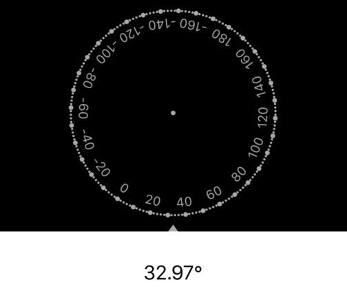
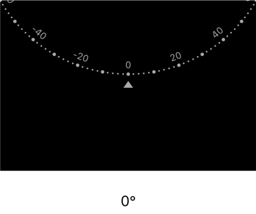
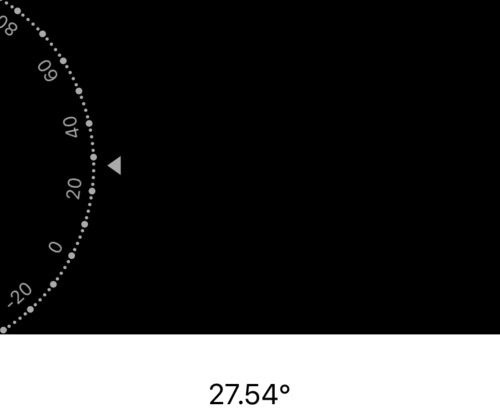

<p align="center">
    
</p>

# Puffer
A swift rotation dial.

<p align="center">
    
    
    
</p>

You can use this tool to mimic a rotation dial just like what Photo.app does
<p align="center">
        

### Main feature

* Show the whole dial with indicator
* Show only part of the dial.
* Rotation range can be limited.
* Default rotation center if the center of the dial. You can set your own rotation center.
* Customized colors.

## Install

### CocoaPods

```ruby
pod 'Puffer', '~> 0.11'
```
You may also need the code below in your pod file if compile errors happen because of different swift version.

```ruby
post_install do |installer|
    installer.pods_project.targets.each do |target|
      if ['Mantis'].include? target.name
        target.build_configurations.each do |config|
          config.build_settings['SWIFT_VERSION'] = '4.2'
        end
      end
    end
  end
```
## Usage

* Create a default Rotation Dial
```swift
Puffer.createDial()
```

* Create a customized Rotation Dial
```swift
var config = Puffer.Config()

// Do some settings to config
...

Puffer.createDial(config: config)
```

<div>Icons made by <a href="https://www.freepik.com" title="Freepik">Freepik</a> from <a href="https://www.flaticon.com/" title="Flaticon">www.flaticon.com</a> is licensed by <a href="http://creativecommons.org/licenses/by/3.0/" title="Creative Commons BY 3.0" target="_blank">CC 3.0 BY</a></div>
